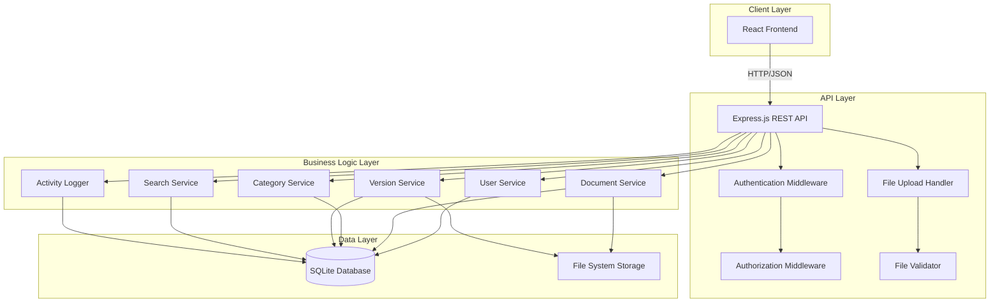
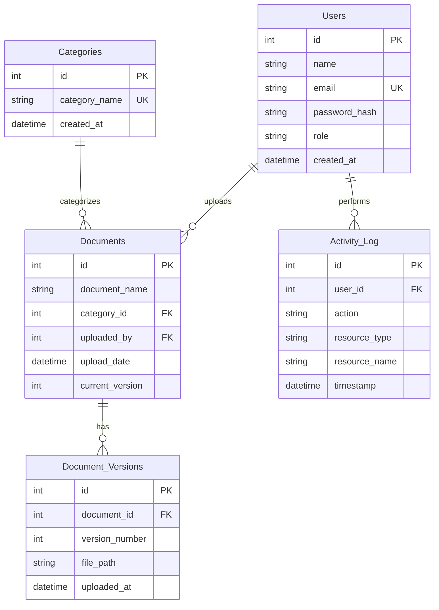

# Design Document: Document Upload & Management System

## Overview

The Document Upload & Management System is a full-stack web application that provides secure document storage, versioning, and access control for enterprise environments. The system implements a three-tier architecture with a React frontend, Express.js backend API, and SQLite database with local file system storage.

### Key Design Goals

- **Security**: Role-based access control (RBAC) with three distinct permission levels (Admin, Employee, Viewer)
- **Scalability**: Support for 10,000+ documents with sub-2-second search performance
- **Reliability**: Comprehensive version tracking with full document history preservation
- **Usability**: Intuitive interface with advanced search, filtering, and dashboard analytics
- **Maintainability**: Clean separation of concerns with modular component architecture

### Technology Stack

- **Frontend**: React.js 18+ with Tailwind CSS for responsive UI
- **Backend**: Node.js with Express.js REST API framework
- **Database**: SQLite 3 for relational data storage
- **Storage**: Local file system with organized directory structure
- **Authentication**: JWT (JSON Web Tokens) for stateless session management
- **File Processing**: Multer for multipart form handling, file-type for MIME validation

## Architecture

### System Architecture Diagram



### Architectural Patterns

**Three-Tier Architecture**: Clear separation between presentation (React), business logic (Express services), and data persistence (SQLite + file system).

**RESTful API Design**: Stateless HTTP endpoints following REST conventions with resource-based URLs and standard HTTP methods.

**Middleware Pipeline**: Request processing through authentication, authorization, validation, and error handling layers.

**Service Layer Pattern**: Business logic encapsulated in service modules that orchestrate database and file system operations.

**Repository Pattern**: Data access abstracted through database query functions, isolating SQL from business logic.

## Components and Interfaces

### Frontend Components

#### 1. Authentication Components

**LoginPage**

- Purpose: User authentication interface
- Props: None (uses React Router for navigation)
- State: `{ email, password, error, loading }`
- Key Functions:
  - `handleLogin()`: Validates credentials, calls `/api/auth/login`, stores JWT token
  - `handleInputChange()`: Updates form state
- API Calls: `POST /api/auth/login`

**ProtectedRoute**

- Purpose: Route guard for authenticated pages
- Props: `{ children, requiredRole }`
- Behavior: Redirects to login if no valid token, checks role permissions
- Uses: JWT token from localStorage

#### 2. Document Management Components

**DocumentList**

- Purpose: Display paginated document table with sorting and actions
- Props: `{ userRole }`
- State: `{ documents, sortColumn, sortDirection, currentPage, totalPages, loading }`
- Key Functions:
  - `fetchDocuments()`: Loads document list from API
  - `handleSort()`: Updates sort parameters and refetches
  - `handlePageChange()`: Navigates pagination
  - `handleDelete()`: Admin-only document deletion
- API Calls: `GET /api/documents?page=X&sort=Y&order=Z`

**DocumentUpload**

- Purpose: File upload form with category selection
- Props: `{ onUploadSuccess }`
- State: `{ selectedFile, category, uploading, progress, error }`
- Key Functions:
  - `handleFileSelect()`: Validates file type and size client-side
  - `handleUpload()`: Submits multipart form data
  - `handleProgress()`: Updates upload progress bar
- API Calls: `POST /api/documents/upload`
- Validation: File size ≤ 20MB, allowed extensions: PDF, DOCX, XLSX, PNG, JPG, JPEG

**DocumentSearch**

- Purpose: Search interface with filters
- Props: `{ onSearchResults }`
- State: `{ query, categoryFilter, dateRange, results, searching }`
- Key Functions:
  - `handleSearch()`: Submits search query with filters
  - `handleFilterChange()`: Updates filter state
  - `clearFilters()`: Resets search state
- API Calls: `GET /api/documents/search?q=X&category=Y&date=Z`

**VersionHistory**

- Purpose: Display document version timeline
- Props: `{ documentId }`
- State: `{ versions, loading }`
- Key Functions:
  - `fetchVersions()`: Loads version history
  - `handleDownloadVersion()`: Downloads specific version
- API Calls: `GET /api/documents/:id/versions`, `GET /api/documents/:id/versions/:versionNumber/download`

#### 3. Dashboard Components

**Dashboard**

- Purpose: System statistics and recent activity overview
- Props: `{ userRole }`
- State: `{ stats, recentDocuments, loading }`
- Key Functions:
  - `fetchDashboardData()`: Loads statistics and recent documents
- API Calls: `GET /api/dashboard/stats`
- Displays:
  - Total documents count
  - Total categories count
  - 10 most recent documents
  - Admin-only: User counts by role

**ActivityLog** (Admin only)

- Purpose: Audit trail of system actions
- Props: None
- State: `{ activities, filters, currentPage, loading }`
- Key Functions:
  - `fetchActivities()`: Loads activity log with filters
  - `handleFilterChange()`: Updates filter criteria
- API Calls: `GET /api/activities?user=X&action=Y&dateRange=Z`

#### 4. Category Management Components

**CategoryManager** (Admin only)

- Purpose: CRUD operations for categories
- Props: None
- State: `{ categories, newCategoryName, editing, loading }`
- Key Functions:
  - `fetchCategories()`: Loads all categories
  - `handleCreate()`: Creates new category
  - `handleUpdate()`: Modifies category name
  - `handleDelete()`: Deletes category (with validation)
- API Calls: `GET /api/categories`, `POST /api/categories`, `PUT /api/categories/:id`, `DELETE /api/categories/:id`

#### 5. User Management Components

**UserManager** (Admin only)

- Purpose: User account administration
- Props: None
- State: `{ users, newUser, editing, loading }`
- Key Functions:
  - `fetchUsers()`: Loads all users
  - `handleCreateUser()`: Creates new user account
  - `handleUpdateRole()`: Changes user role
  - `handleDeleteUser()`: Removes user account
- API Calls: `GET /api/users`, `POST /api/users`, `PUT /api/users/:id`, `DELETE /api/users/:id`

### Backend API Endpoints

#### Authentication Endpoints

**POST /api/auth/login**

- Purpose: Authenticate user and issue JWT token
- Request Body: `{ email: string, password: string }`
- Response: `{ token: string, user: { id, name, email, role } }`
- Status Codes: 200 (success), 401 (invalid credentials), 500 (server error)
- Security: Bcrypt password verification, JWT token generation with 24-hour expiration

**POST /api/auth/logout**

- Purpose: Invalidate session (client-side token removal)
- Response: `{ message: "Logged out successfully" }`
- Status Codes: 200

#### Document Endpoints

**GET /api/documents**

- Purpose: Retrieve paginated document list
- Query Parameters: `page`, `limit`, `sort`, `order`
- Response: `{ documents: [], totalPages, currentPage }`
- Authorization: All authenticated users
- Status Codes: 200, 401, 500

**POST /api/documents/upload**

- Purpose: Upload new document or new version
- Request: Multipart form data with `file`, `category`, `documentId` (optional for versioning)
- Response: `{ document: { id, name, category, version, uploadedBy, uploadDate } }`
- Authorization: Admin, Employee
- Validation: File type, size, MIME type, executable content scan
- Status Codes: 201 (created), 400 (validation error), 401, 403, 413 (file too large), 500

**GET /api/documents/:id**

- Purpose: Retrieve document metadata
- Response: `{ document: { id, name, category, uploadedBy, uploadDate, currentVersion } }`
- Authorization: All authenticated users
- Status Codes: 200, 401, 404, 500

**GET /api/documents/:id/download**

- Purpose: Download current version of document
- Response: File stream with original filename
- Authorization: All authenticated users
- Status Codes: 200, 401, 404, 500

**GET /api/documents/:id/versions**

- Purpose: Retrieve version history
- Response: `{ versions: [{ versionNumber, uploadedAt, uploadedBy, filePath }] }`
- Authorization: All authenticated users
- Status Codes: 200, 401, 404, 500

**GET /api/documents/:id/versions/:versionNumber/download**

- Purpose: Download specific version
- Response: File stream
- Authorization: All authenticated users
- Status Codes: 200, 401, 404, 500

**DELETE /api/documents/:id**

- Purpose: Delete document and all versions
- Response: `{ message: "Document deleted successfully" }`
- Authorization: Admin only
- Side Effects: Removes all version files from storage, logs deletion activity
- Status Codes: 200, 401, 403, 404, 500

**GET /api/documents/search**

- Purpose: Search documents by multiple criteria
- Query Parameters: `q` (query string), `category`, `dateFrom`, `dateTo`
- Response: `{ documents: [], count }`
- Authorization: All authenticated users
- Performance: Must complete within 2 seconds for 10,000 documents
- Status Codes: 200, 401, 500

#### Category Endpoints

**GET /api/categories**

- Purpose: Retrieve all categories
- Response: `{ categories: [{ id, name, createdAt, documentCount }] }`
- Authorization: All authenticated users
- Status Codes: 200, 401, 500

**POST /api/categories**

- Purpose: Create new category
- Request Body: `{ name: string }`
- Response: `{ category: { id, name, createdAt } }`
- Authorization: Admin only
- Status Codes: 201, 400, 401, 403, 500

**PUT /api/categories/:id**

- Purpose: Update category name
- Request Body: `{ name: string }`
- Response: `{ category: { id, name, createdAt } }`
- Authorization: Admin only
- Status Codes: 200, 400, 401, 403, 404, 500

**DELETE /api/categories/:id**

- Purpose: Delete category
- Response: `{ message: "Category deleted successfully" }`
- Authorization: Admin only
- Validation: Prevents deletion if category contains documents
- Status Codes: 200, 400 (has documents), 401, 403, 404, 500

#### User Endpoints

**GET /api/users**

- Purpose: Retrieve all users
- Response: `{ users: [{ id, name, email, role, createdAt }] }`
- Authorization: Admin only
- Status Codes: 200, 401, 403, 500

**POST /api/users**

- Purpose: Create new user account
- Request Body: `{ name, email, password, role }`
- Response: `{ user: { id, name, email, role, createdAt } }`
- Authorization: Admin only
- Security: Password hashed with bcrypt before storage
- Status Codes: 201, 400, 401, 403, 500

**PUT /api/users/:id**

- Purpose: Update user details or role
- Request Body: `{ name?, email?, role? }`
- Response: `{ user: { id, name, email, role } }`
- Authorization: Admin only
- Status Codes: 200, 400, 401, 403, 404, 500

**DELETE /api/users/:id**

- Purpose: Delete user account
- Response: `{ message: "User deleted successfully" }`
- Authorization: Admin only
- Side Effects: Logs deletion activity
- Status Codes: 200, 401, 403, 404, 500

#### Dashboard Endpoints

**GET /api/dashboard/stats**

- Purpose: Retrieve system statistics
- Response: `{ totalDocuments, totalCategories, recentDocuments: [], totalUsers?, usersByRole? }`
- Authorization: All authenticated users (admin fields conditional)
- Status Codes: 200, 401, 500

#### Activity Log Endpoints

**GET /api/activities**

- Purpose: Retrieve activity log with filters
- Query Parameters: `user`, `action`, `dateFrom`, `dateTo`, `page`, `limit`
- Response: `{ activities: [{ id, userId, userName, action, resourceType, resourceName, timestamp }], totalPages }`
- Authorization: Admin only
- Status Codes: 200, 401, 403, 500

### Backend Services

#### UserService

**Responsibilities**: User account management, authentication, password hashing

**Key Methods**:

- `authenticateUser(email, password)`: Verifies credentials, returns user object
- `createUser(name, email, password, role)`: Creates new user with hashed password
- `getUserById(id)`: Retrieves user by ID
- `getAllUsers()`: Returns all users (admin function)
- `updateUser(id, updates)`: Modifies user details
- `deleteUser(id)`: Removes user account
- `hashPassword(password)`: Bcrypt hashing with salt rounds = 10
- `verifyPassword(password, hash)`: Compares password with stored hash

**Database Tables**: Users

#### DocumentService

**Responsibilities**: Document upload, download, metadata management, file storage

**Key Methods**:

- `uploadDocument(file, category, uploadedBy, documentId?)`: Handles new upload or version
- `getDocumentById(id)`: Retrieves document metadata
- `getAllDocuments(page, limit, sort, order)`: Paginated document list
- `downloadDocument(id, versionNumber?)`: Streams file from storage
- `deleteDocument(id)`: Removes document, all versions, and files
- `storeFile(file, category, documentId, versionNumber)`: Saves file to organized directory structure
- `validateFile(file)`: Checks file type, size, MIME type, executable content

**Database Tables**: Documents, Document_Versions

**File Storage Structure**:

```
uploads/
  ├── HR_Documents/
  │   ├── doc_1_v1.pdf
  │   ├── doc_1_v2.pdf
  ├── Finance/
  ├── Legal/
  ├── Projects/
  └── Reports/
```

#### CategoryService

**Responsibilities**: Category CRUD operations, validation

**Key Methods**:

- `getAllCategories()`: Returns all categories with document counts
- `getCategoryById(id)`: Retrieves single category
- `createCategory(name)`: Creates new category
- `updateCategory(id, name)`: Modifies category name
- `deleteCategory(id)`: Removes category (validates no documents exist)
- `validateCategoryEmpty(id)`: Checks if category has documents

**Database Tables**: Categories

#### VersionService

**Responsibilities**: Version tracking, version history management

**Key Methods**:

- `createVersion(documentId, versionNumber, filePath)`: Records new version
- `getVersionHistory(documentId)`: Returns all versions for a document
- `getVersion(documentId, versionNumber)`: Retrieves specific version metadata
- `getNextVersionNumber(documentId)`: Calculates next version number
- `getAllVersionsForDocument(documentId)`: Returns version records for deletion

**Database Tables**: Document_Versions

#### SearchService

**Responsibilities**: Document search with multiple criteria, performance optimization

**Key Methods**:

- `searchDocuments(query, filters)`: Executes search with query and filters
- `buildSearchQuery(query, filters)`: Constructs SQL with WHERE clauses
- `parseFilters(filters)`: Validates and normalizes filter parameters

**Search Criteria**:

- Document name (LIKE match)
- Category name (exact or LIKE match)
- Uploader name (LIKE match)
- Upload date range (BETWEEN)

**Performance Requirements**: Sub-2-second response for 10,000 documents

**Database Tables**: Documents (with JOINs to Categories and Users)

**Optimization Strategy**: Database indexes on frequently searched columns (document_name, category_id, upload_date)

#### ActivityService

**Responsibilities**: Activity logging, audit trail

**Key Methods**:

- `logActivity(userId, action, resourceType, resourceName)`: Creates activity log entry
- `getActivities(filters, page, limit)`: Retrieves filtered activity log
- `logUpload(userId, documentName)`: Convenience method for upload logging
- `logDownload(userId, documentName, versionNumber)`: Convenience method for download logging
- `logDeletion(userId, resourceType, resourceName)`: Convenience method for deletion logging

**Activity Types**: UPLOAD, DOWNLOAD, DELETE_DOCUMENT, DELETE_USER, CREATE_USER, CREATE_CATEGORY, DELETE_CATEGORY

**Database Tables**: Activity_Log

### Middleware Components

#### Authentication Middleware

**Purpose**: Verify JWT token and attach user to request

**Implementation**:

```javascript
function authenticateToken(req, res, next) {
  const token = req.headers["authorization"]?.split(" ")[1];
  if (!token) return res.status(401).json({ error: "No token provided" });

  jwt.verify(token, process.env.JWT_SECRET, (err, user) => {
    if (err) return res.status(401).json({ error: "Invalid token" });
    req.user = user;
    next();
  });
}
```

#### Authorization Middleware

**Purpose**: Enforce role-based access control

**Implementation**:

```javascript
function requireRole(...allowedRoles) {
  return (req, res, next) => {
    if (!allowedRoles.includes(req.user.role)) {
      return res.status(403).json({ error: "Insufficient permissions" });
    }
    next();
  };
}
```

**Usage**: `router.post('/upload', authenticateToken, requireRole('Admin', 'Employee'), uploadHandler)`

#### File Upload Middleware

**Purpose**: Handle multipart form data with Multer

**Configuration**:

- Storage: Memory storage for validation before disk write
- File size limit: 20MB
- File filter: Allowed extensions only

#### Error Handling Middleware

**Purpose**: Centralized error response formatting

**Implementation**:

```javascript
function errorHandler(err, req, res, next) {
  console.error(err.stack);

  if (err.name === "ValidationError") {
    return res.status(400).json({ error: err.message });
  }

  if (err.name === "UnauthorizedError") {
    return res.status(401).json({ error: "Authentication required" });
  }

  res.status(500).json({ error: "Internal server error" });
}
```

## Data Models

### Database Schema

#### Users Table

```sql
CREATE TABLE Users (
  id INTEGER PRIMARY KEY AUTOINCREMENT,
  name TEXT NOT NULL,
  email TEXT UNIQUE NOT NULL,
  password_hash TEXT NOT NULL,
  role TEXT NOT NULL CHECK(role IN ('Admin', 'Employee', 'Viewer')),
  created_at DATETIME DEFAULT CURRENT_TIMESTAMP
);

CREATE INDEX idx_users_email ON Users(email);
```

**Constraints**:

- Email must be unique
- Role must be one of: Admin, Employee, Viewer
- Password stored as bcrypt hash (never plaintext)

#### Categories Table

```sql
CREATE TABLE Categories (
  id INTEGER PRIMARY KEY AUTOINCREMENT,
  category_name TEXT UNIQUE NOT NULL,
  created_at DATETIME DEFAULT CURRENT_TIMESTAMP
);

CREATE INDEX idx_categories_name ON Categories(category_name);
```

**Constraints**:

- Category name must be unique
- Cannot delete category with associated documents

**Default Categories**: HR Documents, Finance, Legal, Projects, Reports

#### Documents Table

```sql
CREATE TABLE Documents (
  id INTEGER PRIMARY KEY AUTOINCREMENT,
  document_name TEXT NOT NULL,
  category_id INTEGER NOT NULL,
  uploaded_by INTEGER NOT NULL,
  upload_date DATETIME DEFAULT CURRENT_TIMESTAMP,
  current_version INTEGER DEFAULT 1,
  FOREIGN KEY (category_id) REFERENCES Categories(id) ON DELETE RESTRICT,
  FOREIGN KEY (uploaded_by) REFERENCES Users(id) ON DELETE CASCADE
);

CREATE INDEX idx_documents_name ON Documents(document_name);
CREATE INDEX idx_documents_category ON Documents(category_id);
CREATE INDEX idx_documents_upload_date ON Documents(upload_date);
CREATE INDEX idx_documents_uploader ON Documents(uploaded_by);
```

**Constraints**:

- category_id must reference valid Category (ON DELETE RESTRICT prevents category deletion)
- uploaded_by must reference valid User
- current_version tracks latest version number

#### Document_Versions Table

```sql
CREATE TABLE Document_Versions (
  id INTEGER PRIMARY KEY AUTOINCREMENT,
  document_id INTEGER NOT NULL,
  version_number INTEGER NOT NULL,
  file_path TEXT NOT NULL,
  uploaded_at DATETIME DEFAULT CURRENT_TIMESTAMP,
  FOREIGN KEY (document_id) REFERENCES Documents(id) ON DELETE CASCADE,
  UNIQUE(document_id, version_number)
);

CREATE INDEX idx_versions_document ON Document_Versions(document_id);
```

**Constraints**:

- document_id must reference valid Document (ON DELETE CASCADE removes versions when document deleted)
- Unique constraint on (document_id, version_number) prevents duplicate versions
- file_path stores relative path to file in storage

#### Activity_Log Table

```sql
CREATE TABLE Activity_Log (
  id INTEGER PRIMARY KEY AUTOINCREMENT,
  user_id INTEGER NOT NULL,
  action TEXT NOT NULL,
  resource_type TEXT NOT NULL,
  resource_name TEXT NOT NULL,
  timestamp DATETIME DEFAULT CURRENT_TIMESTAMP,
  FOREIGN KEY (user_id) REFERENCES Users(id) ON DELETE CASCADE
);

CREATE INDEX idx_activity_user ON Activity_Log(user_id);
CREATE INDEX idx_activity_action ON Activity_Log(action);
CREATE INDEX idx_activity_timestamp ON Activity_Log(timestamp);
```

**Action Types**: UPLOAD, DOWNLOAD, DELETE_DOCUMENT, DELETE_USER, CREATE_USER, CREATE_CATEGORY, DELETE_CATEGORY

**Resource Types**: Document, User, Category

### Entity Relationships



### Data Transfer Objects (DTOs)

#### UserDTO

```typescript
{
  id: number,
  name: string,
  email: string,
  role: 'Admin' | 'Employee' | 'Viewer',
  createdAt: string
}
```

#### DocumentDTO

```typescript
{
  id: number,
  documentName: string,
  category: string,
  uploadedBy: string,
  uploadDate: string,
  currentVersion: number
}
```

#### VersionDTO

```typescript
{
  versionNumber: number,
  uploadedAt: string,
  uploadedBy: string,
  filePath: string
}
```

#### ActivityDTO

```typescript
{
  id: number,
  userId: number,
  userName: string,
  action: string,
  resourceType: string,
  resourceName: string,
  timestamp: string
}
```

## Correctness Properties

_A property is a characteristic or behavior that should hold true across all valid executions of a system—essentially, a formal statement about what the system should do. Properties serve as the bridge between human-readable specifications and machine-verifiable correctness guarantees._

### Property Reflection

After analyzing all acceptance criteria, I identified the following redundancies and consolidations:

**Redundancies Eliminated**:

- 12.1 is subsumed by 2.1 (file extension validation)
- 7.5 is subsumed by 7.1 (Admin permissions include user management)
- 14.4 is subsumed by 7.4 (authorization error messages)
- 13.1-13.4 are structural requirements, not behavioral properties

**Properties Consolidated**:

- Upload metadata validation (2.4) and version metadata validation (6.3) share similar patterns but test different entities
- Activity logging properties (11.1, 11.2, 11.3) can be consolidated into a single comprehensive logging property
- Dashboard statistics properties (9.1, 9.2) can be consolidated into a single accuracy property

### Authentication Properties

#### Property 1: Valid credentials create authenticated sessions

_For any_ valid user credentials (email and password), when authentication is attempted, the system should return a valid JWT token containing the user's identity and role.

**Validates: Requirements 1.1**

#### Property 2: Invalid credentials are rejected

_For any_ invalid credentials (non-existent email or incorrect password), when authentication is attempted, the system should reject the request and return an authentication error.

**Validates: Requirements 1.2**

#### Property 3: Passwords are cryptographically hashed

_For any_ user account, the stored password should be a bcrypt hash, and the same plaintext password should produce different hashes due to salting.

**Validates: Requirements 1.3**

### Document Upload Properties

#### Property 4: Allowed file types are accepted

_For any_ file with an allowed extension (PDF, DOCX, XLSX, PNG, JPG, JPEG) uploaded by Admin or Employee users, the system should accept the upload and store the file.

**Validates: Requirements 2.1**

#### Property 5: Documents are stored in category-organized directories

_For any_ successfully uploaded document, the file should be stored in the Document_Store under a directory matching its category name.

**Validates: Requirements 2.3**

#### Property 6: Upload creates complete metadata

_For any_ successfully uploaded document, the system should create a metadata record containing document name, category, uploader identity, upload timestamp, and version number 1.

**Validates: Requirements 2.4**

#### Property 7: Category selection is required

_For any_ document upload attempt without a category selection, the system should reject the upload and return a validation error.

**Validates: Requirements 3.3**

#### Property 8: MIME type matches file extension

_For any_ uploaded file, if the MIME type does not match the file extension, the system should reject the upload and return a validation error.

**Validates: Requirements 12.2**

#### Property 9: Executable content is rejected

_For any_ uploaded file containing executable code, the system should reject the upload and return a security validation error.

**Validates: Requirements 12.4**

### Category Management Properties

#### Property 10: Category creation stores name and timestamp

_For any_ new category created by an Admin, the system should store the category name and creation timestamp in the database.

**Validates: Requirements 3.2**

#### Property 11: Categories with documents cannot be deleted

_For any_ category containing one or more documents, when an Admin attempts to delete the category, the system should prevent deletion and return an error indicating the category is in use.

**Validates: Requirements 3.5, 13.5**

### Search Properties

#### Property 12: Search matches multiple criteria

_For any_ search query, the system should return all documents where the query matches the document name, category name, uploader name, or upload date.

**Validates: Requirements 4.1**

#### Property 13: Category filter returns only matching documents

_For any_ category filter applied to a search, all returned documents should belong to the selected category.

**Validates: Requirements 4.2**

### Download Properties

#### Property 14: Download retrieves current version

_For any_ document download request, the system should serve the file corresponding to the document's current version number.

**Validates: Requirements 5.1**

#### Property 15: Downloaded files preserve original filenames

_For any_ document download, the served file should have the same filename and extension as the originally uploaded file.

**Validates: Requirements 5.2**

### Version Tracking Properties

#### Property 16: Version numbers increment sequentially

_For any_ existing document, when a new version is uploaded, the version number should be exactly one greater than the previous current version.

**Validates: Requirements 6.1**

#### Property 17: Version files include version identifiers

_For any_ document version, the file path should contain a version identifier that distinguishes it from other versions of the same document.

**Validates: Requirements 6.2**

#### Property 18: Version records contain complete metadata

_For any_ new version upload, the system should create a version record containing document identifier, version number, file path, and upload timestamp.

**Validates: Requirements 6.3**

#### Property 19: Version history contains all versions

_For any_ document with multiple versions, the version history should contain records for all uploaded versions in chronological order.

**Validates: Requirements 6.4**

#### Property 20: Specific versions can be downloaded

_For any_ document version, when a user requests that specific version number, the system should serve the file corresponding to that version.

**Validates: Requirements 6.5**

#### Property 21: Previous versions are preserved

_For any_ document, when a new version is uploaded, all previous version files should remain in the Document_Store and all previous version records should remain in the database.

**Validates: Requirements 6.6**

### Access Control Properties

#### Property 22: Unauthorized operations are denied

_For any_ user attempting an operation not permitted by their role, the system should deny the request and return a 403 authorization error.

**Validates: Requirements 7.4**

### Document Listing Properties

#### Property 23: Document list contains required fields

_For any_ document in the document list response, the record should contain document name, category, uploaded by, upload date, current version, and available actions.

**Validates: Requirements 8.1**

#### Property 24: Documents are sorted by upload date descending by default

_For any_ document list request without explicit sort parameters, the returned documents should be ordered by upload date with the most recent first.

**Validates: Requirements 8.2**

#### Property 25: Sorting reorders documents correctly

_For any_ document list request with sort parameters (column and direction), the returned documents should be ordered according to the specified column in the specified direction.

**Validates: Requirements 8.3**

#### Property 26: Pagination limits results per page

_For any_ document list request, the response should contain at most 50 documents, with pagination metadata for accessing additional pages.

**Validates: Requirements 8.4**

### Dashboard Properties

#### Property 27: Dashboard statistics are accurate

_For any_ dashboard request, the total document count and total category count should match the actual counts in the database.

**Validates: Requirements 9.1, 9.2**

#### Property 28: Recent documents are correctly ordered

_For any_ dashboard request, the recent documents list should contain the 10 most recently uploaded documents ordered by upload date descending.

**Validates: Requirements 9.3**

### Document Deletion Properties

#### Property 29: Document deletion removes all version files

_For any_ document with one or more versions, when an Admin deletes the document, all version files should be removed from the Document_Store.

**Validates: Requirements 10.1**

#### Property 30: Document deletion removes all database records

_For any_ document, when an Admin deletes the document, all metadata records and version records associated with the document should be removed from the database.

**Validates: Requirements 10.2**

### Activity Logging Properties

#### Property 31: All user actions are logged

_For any_ user action (upload, download, delete), the system should create an activity log entry containing user identity, action type, resource name, and timestamp.

**Validates: Requirements 11.1, 11.2, 11.3, 10.3**

#### Property 32: Activity log filtering works correctly

_For any_ activity log request with filters (user, action type, date range), all returned activities should match the specified filter criteria.

**Validates: Requirements 11.4**

### Error Handling Properties

#### Property 33: User errors return descriptive messages

_For any_ operation that fails due to user error (validation failure, invalid input), the error response should contain a message describing the problem and suggested corrective action.

**Validates: Requirements 14.1**

#### Property 34: System errors are handled gracefully

_For any_ operation that fails due to system error (database error, file system error), the system should return a generic error message to the user and log detailed error information.

**Validates: Requirements 14.2**

#### Property 35: Upload failures indicate error type

_For any_ failed file upload, the error response should indicate whether the failure was due to file size, file type, MIME type mismatch, executable content, or storage error.

**Validates: Requirements 14.3**

### Concurrency Properties

#### Property 36: Concurrent uploads are processed independently

_For any_ set of simultaneous document uploads by different users, each upload should complete successfully without data corruption or interference with other uploads.

**Validates: Requirements 15.1**

#### Property 37: Concurrent read/write operations do not conflict

_For any_ document, when one user uploads a new version while another user downloads the current version, both operations should complete successfully without errors.

**Validates: Requirements 15.2**

#### Property 38: Database conflicts trigger retries

_For any_ database write operation that encounters a conflict, the system should retry the operation up to 3 times before returning an error.

**Validates: Requirements 15.4**

### Referential Integrity Properties

#### Property 39: Foreign key constraints are enforced

_For any_ database operation that would violate referential integrity (e.g., deleting a category with documents, referencing non-existent user), the database should reject the operation and return a constraint violation error.

**Validates: Requirements 13.5**

## Error Handling

### Error Categories

The system implements comprehensive error handling across four categories:

#### 1. Validation Errors (400 Bad Request)

**Triggers**:

- File size exceeds 20MB limit
- File extension not in allowed list
- MIME type mismatch with extension
- Executable content detected in file
- Missing required fields (category, document name)
- Empty or whitespace-only input
- Invalid email format
- Category name already exists

**Response Format**:

```json
{
  "error": "Validation failed",
  "message": "File size exceeds 20MB limit. Please upload a smaller file.",
  "field": "file",
  "code": "FILE_TOO_LARGE"
}
```

**User Feedback**: Clear, actionable messages indicating what went wrong and how to fix it

#### 2. Authentication Errors (401 Unauthorized)

**Triggers**:

- No JWT token provided
- Invalid or expired JWT token
- Incorrect email or password
- Session expired (24 hours)

**Response Format**:

```json
{
  "error": "Authentication required",
  "message": "Your session has expired. Please log in again.",
  "code": "TOKEN_EXPIRED"
}
```

**Behavior**: Frontend redirects to login page, clears stored token

#### 3. Authorization Errors (403 Forbidden)

**Triggers**:

- Viewer attempting to upload document
- Employee attempting to delete document
- Non-admin attempting to manage users or categories
- User attempting operation outside role permissions

**Response Format**:

```json
{
  "error": "Insufficient permissions",
  "message": "You do not have permission to delete documents. This action requires Admin role.",
  "requiredRole": "Admin",
  "currentRole": "Employee",
  "code": "FORBIDDEN"
}
```

**User Feedback**: Indicates required permission level

#### 4. System Errors (500 Internal Server Error)

**Triggers**:

- Database connection failure
- File system write error
- Disk space exhausted
- Unexpected exceptions

**Response Format**:

```json
{
  "error": "Internal server error",
  "message": "An unexpected error occurred. Please try again later.",
  "code": "INTERNAL_ERROR",
  "requestId": "uuid-for-tracking"
}
```

**Logging**: Full error stack trace, context, and request details logged server-side

**User Feedback**: Generic message to avoid exposing internal details

### Error Handling Strategy

#### Frontend Error Handling

**Network Errors**:

- Retry logic for transient failures (3 attempts with exponential backoff)
- Offline detection and user notification
- Request timeout handling (30 seconds)

**User Feedback**:

- Toast notifications for errors
- Inline validation messages on forms
- Loading states during async operations
- Disable submit buttons during processing

**Error Recovery**:

- Clear error state on retry
- Preserve form data on validation errors
- Automatic token refresh before expiration

#### Backend Error Handling

**Middleware Pipeline**:

```javascript
app.use(errorHandler);

function errorHandler(err, req, res, next) {
  // Log error with context
  logger.error({
    error: err.message,
    stack: err.stack,
    requestId: req.id,
    userId: req.user?.id,
    path: req.path,
    method: req.method,
  });

  // Categorize and respond
  if (err.name === "ValidationError") {
    return res.status(400).json({
      error: "Validation failed",
      message: err.message,
      field: err.field,
      code: err.code,
    });
  }

  if (err.name === "UnauthorizedError") {
    return res.status(401).json({
      error: "Authentication required",
      message: "Invalid or expired token",
      code: "UNAUTHORIZED",
    });
  }

  if (err.name === "ForbiddenError") {
    return res.status(403).json({
      error: "Insufficient permissions",
      message: err.message,
      requiredRole: err.requiredRole,
      code: "FORBIDDEN",
    });
  }

  // Generic system error
  res.status(500).json({
    error: "Internal server error",
    message: "An unexpected error occurred",
    code: "INTERNAL_ERROR",
    requestId: req.id,
  });
}
```

**Database Error Handling**:

- Connection pool with automatic reconnection
- Transaction rollback on errors
- Retry logic for deadlocks and conflicts (up to 3 attempts)
- Graceful degradation for read-only operations

**File System Error Handling**:

- Disk space checks before writes
- Atomic file operations (write to temp, then rename)
- Cleanup of partial uploads on failure
- Fallback to alternative storage paths if configured

### Error Logging

**Log Levels**:

- ERROR: System errors, unexpected exceptions, failed operations
- WARN: Validation failures, authorization denials, retry attempts
- INFO: Successful operations, user actions
- DEBUG: Detailed execution flow (development only)

**Log Format**:

```json
{
  "timestamp": "2024-01-15T10:30:45.123Z",
  "level": "ERROR",
  "message": "File upload failed",
  "error": "ENOSPC: no space left on device",
  "context": {
    "userId": 42,
    "fileName": "report.pdf",
    "fileSize": 15728640,
    "requestId": "abc-123-def"
  }
}
```

**Log Storage**: Rotating file logs with 30-day retention, separate error log file

## Testing Strategy

### Dual Testing Approach

The system requires both unit tests and property-based tests for comprehensive coverage:

**Unit Tests**: Focus on specific examples, edge cases, and integration points

- Specific user scenarios (e.g., "Admin can delete document")
- Edge cases (e.g., empty search results, missing files)
- Error conditions (e.g., file too large, expired token)
- Integration between components (e.g., upload triggers activity log)

**Property-Based Tests**: Verify universal properties across all inputs

- Generate random valid inputs (documents, users, categories)
- Test properties hold for all generated inputs
- Discover edge cases through randomization
- Minimum 100 iterations per property test

**Complementary Coverage**: Unit tests catch concrete bugs in specific scenarios, property tests verify general correctness across the input space.

### Property-Based Testing Configuration

**Library Selection**:

- **JavaScript/Node.js**: fast-check (recommended for Express backend)
- **React/Frontend**: fast-check with React Testing Library

**Test Configuration**:

```javascript
import fc from "fast-check";

// Minimum 100 iterations per property test
const testConfig = { numRuns: 100 };

// Example property test
describe("Property Tests", () => {
  it("Property 16: Version numbers increment sequentially", () => {
    // Feature: document-upload-management-system, Property 16: Version numbers increment sequentially
    fc.assert(
      fc.property(
        fc.record({
          documentId: fc.integer({ min: 1, max: 10000 }),
          currentVersion: fc.integer({ min: 1, max: 100 }),
        }),
        async ({ documentId, currentVersion }) => {
          // Setup: Create document with currentVersion
          await createDocumentWithVersion(documentId, currentVersion);

          // Action: Upload new version
          const result = await uploadNewVersion(documentId);

          // Assert: New version is currentVersion + 1
          expect(result.versionNumber).toBe(currentVersion + 1);
        },
      ),
      testConfig,
    );
  });
});
```

**Tagging Convention**: Each property test must include a comment referencing the design document property:

```javascript
// Feature: document-upload-management-system, Property {number}: {property_text}
```

### Test Organization

#### Backend Tests

**Structure**:

```
tests/
  ├── unit/
  │   ├── services/
  │   │   ├── userService.test.js
  │   │   ├── documentService.test.js
  │   │   ├── categoryService.test.js
  │   │   ├── versionService.test.js
  │   │   └── searchService.test.js
  │   ├── middleware/
  │   │   ├── auth.test.js
  │   │   └── authorization.test.js
  │   └── utils/
  │       └── fileValidation.test.js
  ├── property/
  │   ├── authentication.property.test.js
  │   ├── upload.property.test.js
  │   ├── versioning.property.test.js
  │   ├── search.property.test.js
  │   ├── accessControl.property.test.js
  │   └── concurrency.property.test.js
  ├── integration/
  │   ├── documentFlow.test.js
  │   ├── versionFlow.test.js
  │   └── userManagement.test.js
  └── fixtures/
      ├── testUsers.js
      ├── testDocuments.js
      └── testDatabase.js
```

**Unit Test Coverage**:

- Service layer methods (target: 90%+ coverage)
- Middleware functions (authentication, authorization, error handling)
- Utility functions (file validation, password hashing)
- Database queries (using in-memory SQLite)

**Property Test Coverage**:

- All 39 correctness properties from design document
- Each property implemented as a single property-based test
- Generators for users, documents, categories, versions
- Minimum 100 iterations per test

**Integration Test Coverage**:

- End-to-end workflows (upload → version → download → delete)
- Multi-user scenarios
- Database transaction handling
- File system operations

#### Frontend Tests

**Structure**:

```
src/
  ├── components/
  │   ├── __tests__/
  │   │   ├── LoginPage.test.jsx
  │   │   ├── DocumentList.test.jsx
  │   │   ├── DocumentUpload.test.jsx
  │   │   └── Dashboard.test.jsx
  │   └── __property__/
  │       ├── documentList.property.test.jsx
  │       └── search.property.test.jsx
  └── services/
      └── __tests__/
          └── api.test.js
```

**Unit Test Coverage**:

- Component rendering with various props
- User interactions (clicks, form submissions)
- State management
- API service functions
- Error handling and display

**Property Test Coverage**:

- UI properties (e.g., Property 23: document list contains required fields)
- Form validation
- Search and filter behavior

### Test Data Generators

**Property-based tests require generators for domain objects**:

```javascript
// User generator
const userArb = fc.record({
  id: fc.integer({ min: 1, max: 10000 }),
  name: fc.string({ minLength: 1, maxLength: 100 }),
  email: fc.emailAddress(),
  role: fc.constantFrom("Admin", "Employee", "Viewer"),
});

// Document generator
const documentArb = fc.record({
  id: fc.integer({ min: 1, max: 10000 }),
  name: fc.string({ minLength: 1, maxLength: 255 }),
  category: fc.constantFrom(
    "HR Documents",
    "Finance",
    "Legal",
    "Projects",
    "Reports",
  ),
  uploadedBy: fc.integer({ min: 1, max: 10000 }),
  currentVersion: fc.integer({ min: 1, max: 100 }),
});

// File generator (for upload tests)
const fileArb = fc.record({
  name: fc.string({ minLength: 1, maxLength: 100 }),
  extension: fc.constantFrom("pdf", "docx", "xlsx", "png", "jpg", "jpeg"),
  size: fc.integer({ min: 1, max: 20 * 1024 * 1024 }), // Up to 20MB
  content: fc.uint8Array({ minLength: 100, maxLength: 1000 }),
});

// Category generator
const categoryArb = fc.record({
  id: fc.integer({ min: 1, max: 1000 }),
  name: fc.string({ minLength: 1, maxLength: 100 }),
});
```

### Test Environment

**Backend**:

- In-memory SQLite database for tests (`:memory:`)
- Temporary file system directory for uploads (cleaned after each test)
- Mock JWT secret for token generation
- Test fixtures for common scenarios

**Frontend**:

- React Testing Library for component tests
- Mock Service Worker (MSW) for API mocking
- Jest for test runner
- fast-check for property-based tests

### Continuous Integration

**Test Execution**:

- Run all tests on every commit
- Separate jobs for unit tests, property tests, integration tests
- Parallel execution for faster feedback
- Code coverage reporting (target: 85%+ overall)

**Performance Tests**:

- Search performance test (10,000 documents, <2 seconds)
- Concurrent upload test (50 simultaneous uploads)
- Load test for dashboard statistics

### Example Test Cases

#### Unit Test Example

```javascript
describe("DocumentService", () => {
  describe("uploadDocument", () => {
    it("should reject files larger than 20MB", async () => {
      const largeFile = createMockFile({ size: 21 * 1024 * 1024 });
      const user = { id: 1, role: "Employee" };

      await expect(
        documentService.uploadDocument(largeFile, "Finance", user.id),
      ).rejects.toThrow("File size exceeds 20MB limit");
    });

    it("should create metadata with version 1 for new documents", async () => {
      const file = createMockFile({ name: "report.pdf", size: 1024 });
      const user = { id: 1, role: "Employee" };

      const result = await documentService.uploadDocument(
        file,
        "Finance",
        user.id,
      );

      expect(result.currentVersion).toBe(1);
      expect(result.documentName).toBe("report.pdf");
      expect(result.uploadedBy).toBe(user.id);
    });
  });
});
```

#### Property Test Example

```javascript
describe("Property Tests: Versioning", () => {
  it("Property 16: Version numbers increment sequentially", () => {
    // Feature: document-upload-management-system, Property 16: Version numbers increment sequentially
    fc.assert(
      fc.property(
        documentArb,
        fc.integer({ min: 1, max: 10 }), // Number of versions to upload
        async (document, versionCount) => {
          // Setup: Create initial document
          const doc = await createDocument(document);

          // Action: Upload multiple versions
          for (let i = 0; i < versionCount; i++) {
            const result = await uploadNewVersion(doc.id);
            expect(result.versionNumber).toBe(i + 2); // +2 because initial is version 1
          }

          // Verify: Final version number is correct
          const finalDoc = await getDocument(doc.id);
          expect(finalDoc.currentVersion).toBe(versionCount + 1);
        },
      ),
      { numRuns: 100 },
    );
  });

  it("Property 21: Previous versions are preserved", () => {
    // Feature: document-upload-management-system, Property 21: Previous versions are preserved
    fc.assert(
      fc.property(
        documentArb,
        fc.array(fc.uint8Array({ minLength: 100, maxLength: 1000 }), {
          minLength: 2,
          maxLength: 5,
        }),
        async (document, versionContents) => {
          // Setup: Create document with multiple versions
          const doc = await createDocument(document);
          const versionIds = [doc.id];

          for (const content of versionContents) {
            const version = await uploadNewVersion(doc.id, content);
            versionIds.push(version.id);
          }

          // Verify: All versions still exist
          const versions = await getVersionHistory(doc.id);
          expect(versions.length).toBe(versionContents.length + 1);

          // Verify: All version files exist in storage
          for (const version of versions) {
            const fileExists = await checkFileExists(version.filePath);
            expect(fileExists).toBe(true);
          }
        },
      ),
      { numRuns: 100 },
    );
  });
});
```

### Test Maintenance

**Best Practices**:

- Keep tests independent (no shared state between tests)
- Use descriptive test names that explain what is being tested
- Clean up test data after each test (database, file system)
- Mock external dependencies (email, third-party APIs)
- Update tests when requirements change
- Review test coverage regularly

**Property Test Maintenance**:

- Review generated test cases when tests fail
- Refine generators to produce more realistic data
- Add shrinking strategies for complex data types
- Document assumptions in property tests
